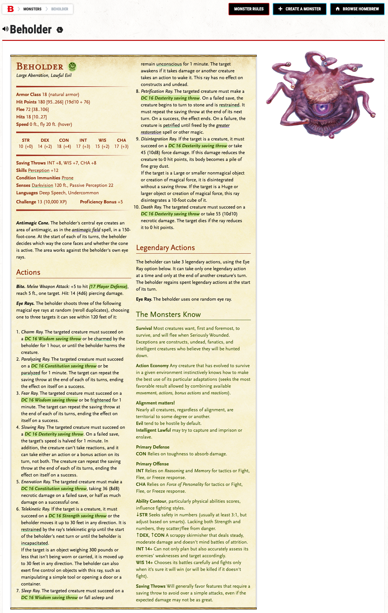

# ddb-greaser

**[INSTALL](https://github.com/tbbstny/ddb-greaser/raw/main/ddb-greaser.user.js)**

A [Tampermonkey](https://www.tampermonkey.net/) (and probably [Greasemonkey](https://www.greasespot.net/), though I don't use it, so have not tested it) script that enhances [D&D Beyond's](https://www.dndbeyond.com/) Monster Stat Blocks on the Monster Details pages and in the Ecounter Builder by
- Adding a link to search [The Monsters Know What They're Doing](https://www.themonstersknow.com/) blog for moster tactics.  May still require some user tweaks, for example a search for "Deva" doesn't return the tactics you are interested in the first page of results, but a search for "Angel" does.
- Calculate and add the MIN/MAX range on **HP**
- Add a new attribute **Hits** as described by [Professor Dungeonmaster](https://youtu.be/MABlOHYommI), using average and min/max range
- Add a new **Player Defense** beside all "To Hit" attacks.  Rather than the DM rolling monster attacks, the players roll to defend.  The player defense roll is d20 + (AC - 10) vs. 12 + Monster's To Hit bouns.  Ties go to the palyer.  This idea also comes by [Professor Dungeonmaster](https://youtu.be/L8If0mcYvnk), and explained in more detail in the comments.  
- Add premises from _The Mosters Know What The're Doing_:
  -  Highlight _**advantages**_ and _**saving throws**_
  -  Add **The Monsters Know** block with premises that apply to _this_ monster

